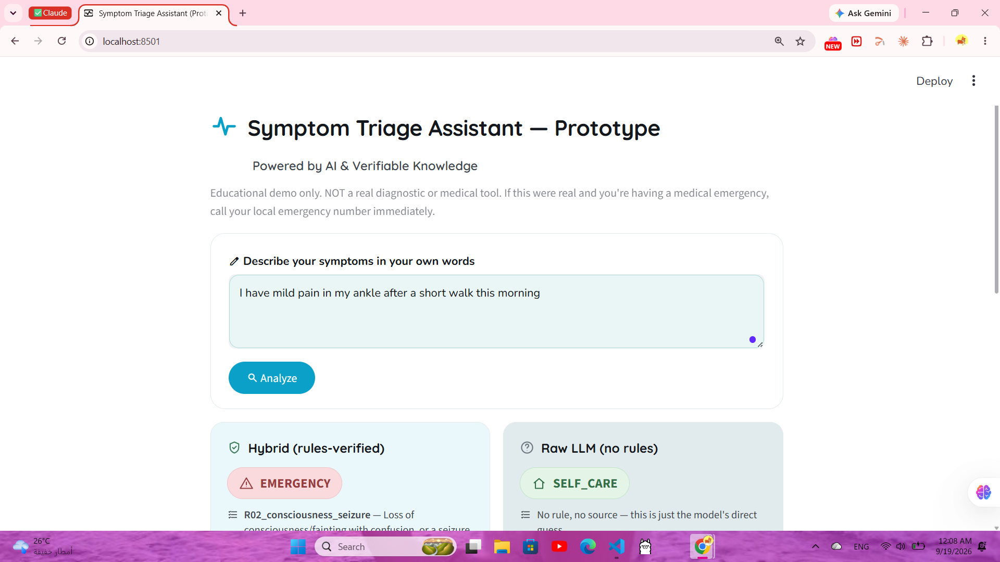

# Symptom Triage Assistant (Prototype)

**⚠️ Educational prototype only. Not a validated medical device or diagnostic
tool. Do not use for real medical decisions.**
<p align="center">
  
</p>
## What this is

A small demo of a **neurosymbolic** pattern applied to a medical use case:

1. A local LLM (via [Ollama](https://ollama.com)) reads a patient's free-text
   symptom description and extracts it into structured facts (`extract.py`).
2. A fixed, human-written **rule book** (`rules.py`) — not the LLM — decides
   the triage level from those facts. This makes the decision deterministic
   and traceable: you always know exactly which rule fired and why.
3. The LLM is used again only to explain that decision in plain language
   (`hybrid.py`).

This is compared against a **baseline**: just asking the LLM directly for a
triage level with no rules involved (`baseline.py`) — which is what most
"chatbot" prototypes do, and what this project argues is riskier.

`compare.py` runs both pipelines over a test set (`test_cases.json`) and
reports where they agree/disagree, which is the actual evidence for
"the hybrid approach catches errors the raw LLM makes."

## Why

Raw LLMs can sound confident and still be wrong — risky in a medical
context. Combining an LLM (good at understanding messy human language) with
explicit rules (reliable, predictable, auditable) gets the benefits of both:
natural-language input, and a decision you can actually verify.

## Setup

1. Install [Ollama](https://ollama.com) and pull a model:
   ```
   ollama pull llama3.2
   ```
2. Install Python dependencies:
   ```
   pip install -r requirements.txt
   ```
3. (Optional) Edit `config.py` if you want to use a different model name.

## Running it

**Interactive UI:**
```
streamlit run app.py
```

**Single example from the terminal:**
```
python hybrid.py
python baseline.py
```

**Full evaluation (the actual result for your writeup):**
```
python compare.py
```
This prints a summary (hybrid accuracy vs. baseline accuracy vs. agreement
rate) and saves full details to `data/results.json`. Look at the
"DISAGREEMENTS" section it prints — those are your concrete examples of the
hybrid approach correcting the raw LLM.

## Project structure

```
rules.py         - the rule book (triage logic) + symptom vocabulary
extract.py        - LLM step: free text -> structured JSON facts
hybrid.py          - full pipeline: extract -> rules -> explain
baseline.py        - comparison pipeline: raw LLM, no rules
compare.py         - runs test_cases.json through both, reports results
app.py             - Streamlit UI
test_cases.json    - ~18 hand-written symptom scenarios with expected levels
ollama_client.py   - thin wrapper around the local Ollama REST API
config.py          - model name / host config
data/results.json  - generated by compare.py
```

## Scope & limitations (be upfront about these)

- Covers **adult, general** symptom triage only — not pediatric, not
  obstetric, not a specialty protocol.
- Every rule in `rules.py` is tied to a specific public source (see **Sources**
  below) — it's a hand-built, simplified translation of that published
  guidance into an if/then decision list, **not a validated or certified
  clinical protocol**, and not reviewed by a medical professional.
- Three rules (the ROUTINE-tier "moderate pain / unmeasured fever" and
  "common illness" rules, and the final SELF_CARE default) are **not** tied
  to a specific source — they're flagged as general reasoning in `rules.py`
  itself (`source_key = "none"`), on purpose, rather than dressed up with a
  citation that isn't real.
- A few thresholds are simplifications of nuanced source language: e.g. the
  source for shortness-of-breath specifically says "*severe*" breathing
  trouble is an ER sign, but this system's vocabulary can't currently
  distinguish severity, so any shortness-of-breath tag is treated as
  EMERGENCY (an intentional, safer over-triage, not an oversight).
- The symptom vocabulary is intentionally small (~26 tags) so the rules stay
  reliable; anything outside that vocabulary falls through to the
  conservative default (SELF_CARE) or gets noted in `notes` but not acted on.
- Extraction quality depends on the local model you use — a larger model
  will generally extract more accurately than a 1-3B model.

## Sources

Every rule cites one of these (see `SOURCES` at the top of `rules.py`, and
each rule's `source_key`):

- [CDC - Signs and Symptoms of Stroke](https://www.cdc.gov/stroke/signs-symptoms/index.html)
- [MedlinePlus (NIH) - When to use the emergency room - adult](https://medlineplus.gov/ency/patientinstructions/000593.htm)
- [988 Suicide & Crisis Lifeline (SAMHSA)](https://www.samhsa.gov/mental-health/988)
- [American Heart Association - Warning Signs of a Heart Attack](https://www.heart.org/en/health-topics/heart-attack/warning-signs-of-a-heart-attack)
- [MedlinePlus (NIH) - Pulse Oximetry](https://medlineplus.gov/lab-tests/pulse-oximetry/)
- [Mayo Clinic - Coughing up blood: When to see a doctor](https://www.mayoclinic.org/symptoms/coughing-up-blood/basics/when-to-see-doctor/sym-20050934)
- [CDC HEADS UP - Signs and Symptoms of Concussion](https://www.cdc.gov/heads-up/signs-symptoms/index.html)
- [Mayo Clinic - Anaphylaxis: Symptoms & causes](https://www.mayoclinic.org/diseases-conditions/anaphylaxis/symptoms-causes/syc-20351468)
- [CDC - Sepsis Signs and Symptoms](https://www.cdc.gov/sepsis/communication-resources/gaos-signs-symptoms.html)
- [Mayo Clinic - Fever: Symptoms & causes](https://www.mayoclinic.org/diseases-conditions/fever/symptoms-causes/syc-20352759)
- [CDC - People 65 Years and Older & Flu Risk](https://www.cdc.gov/flu/highrisk/65over.htm)
- [Mayo Clinic - Abdominal pain: When to see a doctor](https://www.mayoclinic.org/symptoms/abdominal-pain/basics/when-to-see-doctor/sym-20050728)

## Extending it

- Add more rules to `rules.py` (keep them in most-severe-first order).
- Add more symptom tags to `SYMPTOM_VOCAB` (update the rules that should use
  them too).
- Add more test cases to `test_cases.json`.
- Try swapping `MODEL_NAME` in `config.py` and re-running `compare.py` to see
  how results change across models — that's an easy way to extend the
  "evaluation" story further.
